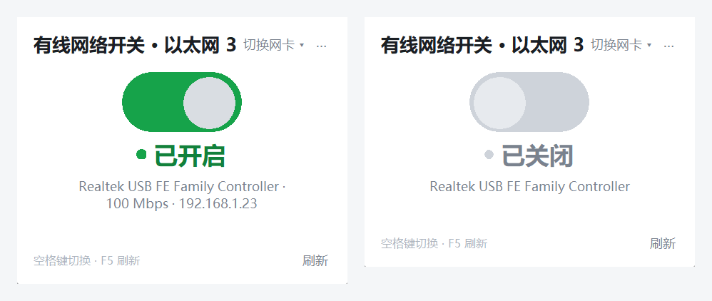

# 有线网络开关 · EthernetSwitch

> 一个极简的 Windows 桌面小工具：**一键启用 / 禁用有线网卡**，实时显示当前状态，点击即生效。

[](LICENSE)
[](#从源码运行)
[](#)



*左：已开启（绿） · 右：已关闭（灰）。真实截屏，非设计稿。*

---

## 为什么做这个

禁用以太网卡在 Windows 上要点开「设置 → 网络和 Internet → 高级网络设置 → 网络适配器」，
或者进「控制面板 → 网络连接」右键禁用 —— 步骤多、路径深，临时切一下网络很麻烦。

这个小工具把它压缩成**一个开关**：双击、点一下，完事。

## 特性

- **一个开关搞定**：界面只有一个大开关，点击立刻生效，不需要任何配置。
- **状态真实可信**：读的是系统里网卡的真实管理状态，切换后会回读确认；失败会明确报错，不会假装成功。
- **快**：状态查询走原生 Win32 API（约 **6~10 ms**），启用 / 禁用走 `netsh`（约 **100 ms**）。对比之下，同样的事用 PowerShell 要 5 秒以上（见[性能](#性能为什么这么实现)）。
- **界面立刻响应**：点下开关就先滑动，再后台确认（乐观 UI），不会卡住等系统返回。
- **自动挑对网卡**：自动排除 Wi-Fi、蓝牙网络连接、VPN 隧道（TAP / WireGuard / 各种 SSL VPN）、虚拟机网卡，只留下真实以太网适配器；多张有线网卡时可手动切换。
- **零第三方依赖**：只用 Python 标准库（`tkinter` / `ctypes`），不需要 `pip install` 任何东西。
- **权限处理得体**：切换网卡需要管理员权限，首次启动自动申请；即使你点了「取消」，窗口也不会消失，而是给出提示条让你随时重新授权。
- **能感知外部变化**：状态每 1.5 秒自动刷新，你在别处（比如系统设置里）改了网卡状态，界面会跟着变。

## 快速开始

### 方式一：直接用打包好的 exe（推荐）

到 [Releases](../../releases) 里下载，有两种形态：

| 下载包 | 说明 |
|---|---|
| `EthernetSwitch-v1.1-win64-fast.zip` | **日常用这个。** 解压后运行 `EthernetSwitch.exe`，启动约 **0.26 秒** |
| `EthernetSwitch-v1.1-win64-portable.zip` | 单文件便携版（11.5 MB），启动约 **2~4 秒**（每次启动要解压），适合拷给别人 |

> 两个版本功能完全一样，区别只是 PyInstaller 的打包形态。
> 首次运行会弹一次 UAC 授权框（改网卡状态必须管理员权限）。

### 方式二：从源码运行

需要 Python 3.8+（`tkinter` 是标准库，Windows 官方安装包自带）。

```bat
git clone https://github.com/Baron01010/EthernetSwitch.git
cd EthernetSwitch
run.bat
```

或者直接：

```bat
pythonw app.py
```

`run.bat` 会自动挑选一个带 `tkinter` 的 `pythonw.exe`，避开控制台窗口。

## 使用说明

| 操作 | 效果 |
|---|---|
| 点击中间的开关 | 启用 / 禁用当前有线网卡 |
| `空格` 或 `回车` | 同点击开关 |
| `F5` | 立即刷新状态 |
| `Esc` | 退出 |
| 右上角「切换网卡 ▾」 | 多张有线网卡时手动选择 |
| 右上角 `⋯` | 关于（含当前查询耗时）、创建桌面快捷方式 |

首次启动会自动请求管理员权限。**如果你在 UAC 框点了「取消」**，程序不会退出，
而是以只读方式继续运行，顶部显示黄色提示条，点「授权」可随时重新申请。

## 性能：为什么这么实现

在一台实测「PowerShell 冷启动 1.6 秒」的机器上的真实数据：

| 操作 | 实现方式 | 耗时 |
|---|---|---|
| 读出所有网卡状态 | PowerShell `Get-NetAdapter` | ~5 400 ms |
| 读出所有网卡状态 | **原生 IP Helper API**（`GetIfTable2` 等，ctypes） | **~6~10 ms** |
| 查询 IPv4 地址 | PowerShell `Get-NetIPAddress` | ~4 500~6 600 ms |
| 查询 IPv4 地址 | **原生 `GetIpAddrTable`** | **< 1 ms** |
| 启用 / 禁用网卡 | PowerShell `Enable-NetAdapter` | 5 000 ms 以上 |
| 启用 / 禁用网卡 | **`netsh interface set interface`** | **~100 ms** |

所以程序里状态读取全部走 ctypes 直接调 Windows IP Helper API，一次调用就能拿到
网卡名、描述、运行状态、**管理状态（是否被系统禁用）**、网线是否插入、速率与 IPv4。
只有在极少数把 `netsh` 精简掉的系统上，才回退到 PowerShell。

程序不会为了一个「读状态」去起进程 —— 那是慢的根源。

`bench.py` 是配套的基准脚本，可以随时复测这台机器上各条通道的真实耗时：

```bat
python bench.py
```

## 它怎么挑出「真实有线网卡」

1. **按介质类型**：只看 `802.3`（以太网），排除 `Native 802.11`（无线）；
2. **按关键字过滤**：名称 / 描述里命中 `virtual`、`vmware`、`hyper-v`、`tap-windows`、`bluetooth`、`wlan`、
   `wi-fi`、`vpn`、`tunnel`、`wintun`、`loopback` 等关键词的，一律排除；
3. **按优先级排序**：已启用且有链路的 > 已启用但没插网线的 > 未启用的。

排除清单在 `app.py` 的 `VIRTUAL_HINTS` / `WIRELESS_HINTS` 里，可按需增删。

## 构建自己的 exe

```bat
build_exe.bat
```

脚本会自动完成：建一个独立的构建虚拟环境（`.build-venv`，不污染系统 Python）→ 安装 PyInstaller →
分别产出**目录版**（`fast\`）和**单文件便携版**（`dist\`）。

手工构建的命令等价于：

```bat
:: 目录版：启动快，适合自己日常用
pyinstaller --noconfirm --clean --onedir --windowed --name EthernetSwitch ^
  --icon assets\icon.ico --add-data "assets\icon.ico;assets" --add-data "assets\icon.png;assets" ^
  --distpath fast --workpath build_fast --specpath build_fast app.py

:: 单文件便携版：方便分发
pyinstaller --noconfirm --clean --onefile --windowed --name EthernetSwitch ^
  --icon assets\icon.ico --add-data "assets\icon.ico;assets" --add-data "assets\icon.png;assets" ^
  --distpath dist --workpath build --specpath build app.py
```

## 项目结构

```
EthernetSwitch/
├── app.py                 主程序（GUI + 网卡读写 + 提权），单文件零依赖
├── bench.py               性能基准：对比 PowerShell / netsh / 原生 API 的耗时
├── make_icon.py           程序化生成图标（纯标准库，带抗锯齿）→ assets/icon.png|ico
├── make_screenshot.py     真实截屏生成 docs/preview.png（供 README 用）
├── run.bat                源码方式启动
├── build_exe.bat          一键打包（onedir + onefile）
├── assets/
│   ├── icon.png           界面用图标
│   └── icon.ico           可执行文件图标
└── docs/
    └── preview.png        README 截图
```

## 辅助脚本

```bat
python app.py --selftest    :: 无界面自检：列出所有网卡、指出被识别为有线的那些、各通道耗时
python app.py --uitest      :: 搭好界面后自动退出，用于冒烟测试（不会动网卡）
python bench.py             :: 基准测试各读写通道耗时
python make_icon.py         :: 重新生成图标
python make_screenshot.py   :: 重新生成 README 截图（窗口会在屏幕右下角闪现约 1 秒）
```

`--selftest` 和 `--uitest` 都不会请求管理员权限，也不会改动任何网卡状态，可以放心跑。

## 常见问题

**Q：为什么必须管理员权限？**
启用 / 禁用网络适配器是系统级操作，Windows 要求提权。程序只在你点开关时才执行，不会常驻后台。

**Q：UAC 点了「取消」，程序还能用吗？**
能。它会继续以只读模式运行并显示提示条，点「授权」可随时重新申请。不会白屏、不会卡死。

**Q：切换要等多久？**
正常情况下不明显 —— 开关会先滑过去（乐观 UI），后台执行完再回读确认。禁用网卡本身可能让
网络短暂中断几秒（这是系统行为，不是程序卡顿）。

**Q：杀毒软件报毒？**
PyInstaller 打包的 Python 程序常被启发式误报。本项目开源，可直接用源码方式运行
（`run.bat`），或者用 `build_exe.bat` 自己打包一份。

**Q：能支持 Wi-Fi 吗？**
当前只管理有线网卡。要改的话，`is_wired()` 里放开无线过滤即可，其余逻辑通用。

## 许可证

[MIT](LICENSE)。如需署上你自己的名字或组织，改 `LICENSE` 里的版权行即可。
